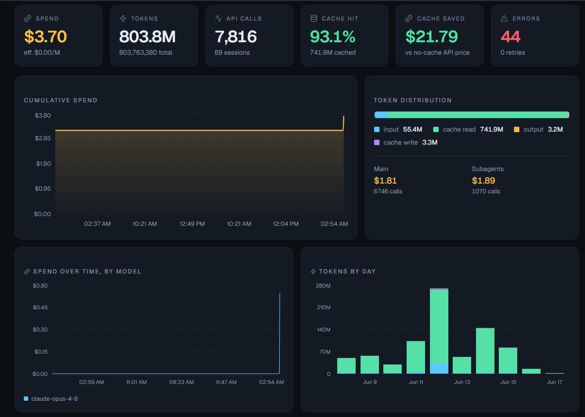
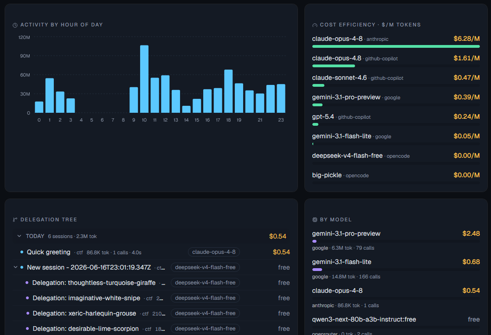

# opencode-tokenomics

Real-time **token usage & cost** for [OpenCode](https://opencode.ai), split by project, in a live web dashboard.

When opencode starts, this plugin boots a small local web server and opens a dashboard in your
browser. It listens to opencode's event stream and shows — live, as you work — how much each
**project**, **model**, and **subagent** is spending, with cache-efficiency and savings analysis.
It's **always-on, real-time, per-project, and in a real UI with charts** rather than a one-shot
text report.





---

## What you get

- **Live spend** — total USD cost, tokens, and API calls, updating in real time over SSE.
- **Per-project split** — usage is keyed by project root, so every repo you touch is tracked
  separately, navigable from a searchable, sortable sidebar that scales to hundreds of projects.
- **Agents & subagents** — child sessions shown as a tree with *who* (agent), *what* (title/model),
  *how much* (cost/tokens/calls) and *how long* (wall-clock duration) for each.
- **Agent × model** — cross-breakdown of which agent spent how much on which `provider/model`.
- **By model** — cost and tokens per `provider/model`.
- **Cache efficiency** — cache hit rate, and the **real** money caching saved (counted only where
  opencode actually billed a per-token cost, so free/self-hosted usage never shows phantom savings).
- **Token distribution** — fresh input / cache read / output / cache write channels.
- **Context breakdown** — estimated split of input tokens across system prompt, tool definitions,
  environment, project tree and custom instructions.
- **Tool usage** — per tool: call count, **failed calls**, estimated output tokens, schema size, complexity, total time.
- **Skills loaded** — which skills were loaded (via the `skill` tool), how many times, and the tokens of skill content pulled into context.
- **Reliability** — errored assistant messages and provider retries, rolled up per model, per session and overall.
- **Charts** — cumulative spend, **spend over time stacked by model**, **tokens by day** (by channel),
  **activity by hour of day**, and **cost efficiency ($/M tokens) per model**.
- **Configurable cards** — a settings panel (gear, top-right) toggles every card on/off and saves to
  `~/.config/opencode/tokenomics.json`. Hidden cards are also **skipped in computation**, so heavy
  views don't tax low-resource machines. Everything starts on.
- **Real vs estimated cost** — "Spend" is always what opencode actually bills (so a **free** model
  reads `$0`/`free`, never phantom spend). On subscription/zen plans that report `cost: 0`, a clearly
  labeled `~$x` / "≈ at API rates" estimate is shown alongside so you still gauge API-equivalent value.

## How it works

```
opencode (Bun)                          your browser
┌───────────────────────────┐          ┌─────────────────────────────┐
│ plugin (src/plugin)       │   SSE    │ dashboard (Vite+React+      │
│  events → aggregator      │ ───────► │  shadcn/ui + recharts)      │
│  per-project snapshots    │  /api/   │  KPIs · charts · tree       │
│  Bun.serve on :5757 ──────┼──────────┤  served from dashboard/dist │
└──────────┬────────────────┘          └─────────────────────────────┘
           │ persists snapshots to ~/.local/share/opencode/tokenomics
           ▼
   projects/<key>.json   ← also read/merged across opencode windows
```

- The plugin translates `message.updated` (assistant billing), `session.created/updated`
  (subagent tree), and tool/agent message parts into per-project `UsageRecord`s.
- The first opencode instance to grab the port runs the web server; other instances (other
  projects/windows) act as writers, and their data reaches the dashboard through the shared
  data directory — so the dashboard shows **all** your projects at once.
- Costs come straight from opencode when available; otherwise they're estimated from
  `pricing.ts` (override in `~/.local/share/opencode/tokenomics/pricing.json`).

## Installation

### From npm

Add the package to the plugin array in your OpenCode config at `~/.config/opencode/opencode.json`:

```json
{
  "plugin": ["@aeondave/opencode-tokenomics@latest"]
}
```

OpenCode installs the plugin and its dependencies automatically on the next start. To pin a
version, replace `@latest` with a specific version (e.g. `@0.1.0`). The published package ships
the built dashboard, so nothing else is needed — restart OpenCode and it opens the dashboard.

### From source (git clone)

Run from a local checkout — useful before publishing or while hacking on the plugin.

Clone the repository and install dependencies (plugin + dashboard), then build the dashboard once
(the plugin serves the built assets from `dashboard/dist`):

```bash
git clone https://github.com/AeonDave/opencode-tokenomics.git
cd opencode-tokenomics
bun install
npm --prefix dashboard install
npm run dashboard:build      # outputs dashboard/dist
```

Create a shim file in your global plugin directory that re-exports the checkout's entry point. The
directory is `plugin` (singular):

- Path: `~/.config/opencode/plugin/tokenomics.ts`
- Content — a single line pointing at the absolute path of the cloned entry point:

```ts
export { default } from "/absolute/path/to/opencode-tokenomics/src/plugin/index.ts"
```

On Windows, use forward slashes and include the drive letter:

```ts
export { default } from "C:/opencode-tokenomics/src/plugin/index.ts"
```

Restart OpenCode. On startup it prints `[tokenomics] live dashboard → http://localhost:5757` and
opens it. The plugin loads from your working tree, so edits to `src/` take effect on the next
restart. Delete the shim file to uninstall. Until you build the dashboard, a built-in live page is
served instead (same data, fewer charts).

Use one method at a time. If you add the npm entry, remove the local shim (and vice versa) to avoid
loading the plugin twice.

## Dashboard development

```bash
npm --prefix dashboard run dev   # Vite dev server on :5173, proxies /api → :5757
```

Run opencode (so the plugin server is up on :5757), then open the Vite dev URL for hot reload.

## Configuration (environment variables)

| Variable | Default | Purpose |
|---|---|---|
| `OPENCODE_TOKENOMICS_PORT` | `5757` | Preferred web server port (auto-scans upward if busy) |
| `OPENCODE_TOKENOMICS_DIR`  | `~/.local/share/opencode/tokenomics` | Data directory |
| `OPENCODE_TOKENOMICS_OPEN` | (on) | Set to `0` to not auto-open the browser |

The port is a *preferred* starting point: if it's taken by another server (e.g. another plugin),
tokenomics scans upward to the next free port and opens the browser there. A second opencode window
detects the running tokenomics server and shares it (one dashboard, all projects) instead of
starting a duplicate.

`pricing.json` in the data dir overrides per-model rates (USD per 1M tokens):

```json
{ "anthropic/claude-opus-4-8": { "input": 5, "output": 25, "cacheRead": 0.5, "cacheWrite": 6.25 } }
```

Set every rate to `0` to treat a model as free — handy for **self-hosted / custom providers** whose
id doesn't contain `free` (e.g. a local vLLM model), so they don't show an API-rate estimate.

## API

- `GET /api/health` → `{ ok: true, service: "opencode-tokenomics" }`
- `GET /api/stats` → merged `GlobalSnapshot` (all projects)
- `GET /api/stream` → `text/event-stream`, pushes the `GlobalSnapshot` on every change
- `GET /api/config` → `{ cards: { <id>: boolean } }` (which cards are enabled)
- `PUT /api/config` → body `{ cards }` — persists the card selection to `~/.config/opencode/tokenomics.json`
- `DELETE /api/projects/:key` · `DELETE /api/projects` → delete one project's stored data, or all

## Notes & limitations

- Per-token cost is taken from opencode when present; the price table is a fallback/estimate.
- Genuinely free models (id contains a `free` token, e.g. `deepseek-v4-flash-free`, `…:free`) are
  treated as `$0` with no estimate — their tokens are still tracked, only the dollar figure is zero.
- The cache-savings figure counts only records opencode actually billed (real cost > 0): it's the
  difference between paying full input price and the cache-discounted price at table rates. Free,
  self-hosted and subscription ($0) usage contributes no savings — caching saves no *real* money there.
- The native input/output/cache/reasoning token channels are **exact** (straight from opencode).
  The context breakdown, per-tool output/schema sizes and tool complexity are **estimates** from a
  lightweight, dependency-free tokenizer (`~chars/4` blended with word count) applied to the system
  prompt and tool schemas — good for proportions, not billing.

MIT
